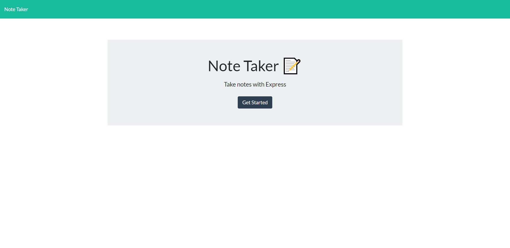
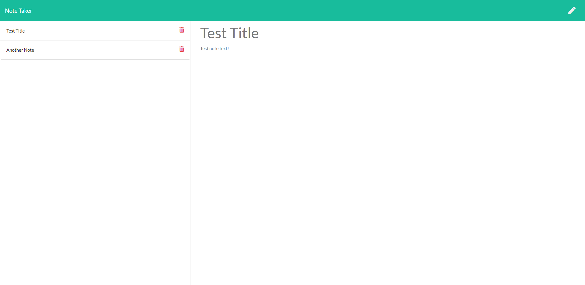

# cloud-note

An online notepad for a single user

Powered by [Express](https://expressjs.com/)

Deployment: [Note Taker](https://duck-cloud-note.herokuapp.com/)

# Installation

After cloning the repository and installing [Node.js](https://nodejs.org/), run the following command in the package directory

```
npm install
```

# Usage

To start the web server, run the following command in the package directory:

```
npm run start
```

# Screenshots

<details>

<summary>Expand/Collapse</summary>





</details>
